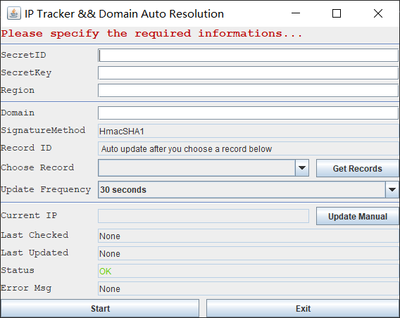

# auto-domain
腾讯云域名自动解析更新工具

## Functions：DDNS
1. 封装腾讯云域名解析API及调用API所需的加密算法
2. 提供定时检测运行程序主机的IP，并能够在IP发生改变时自动更新至选中的腾讯云域名中；
3. 该项目主要用于公网IP不断发生变化，在本地路由器上已经配置好了端口映射，希望能够通过稳定的域名访问局域网内主机或其他设备的用户；

## Requirements:
1. 你首先需要有一个腾讯云账户以及一个腾讯云的域名；
2. 申请开通腾讯云的API调用服务，并获得域名解析服务的API相应的密钥和SecretKey等信息；
3. 在本地的路由器上配置好对应设备的端口映射，例如，windows远程桌面默认端口为3389；
4. 在局域网内的任意一台主机上运行该项目，并输入步骤2中的相关信息，点击Start；
现在，通过您的域名尝试随时随地访问您局域网中的设备吧！

## A Simple Example:
你需要在外网/公网上访问您家里的主机设备，但是苦于家庭网络公网IP并非独占，会发生变化，一旦IP更新，你便无法通过原来的访问你的设备了，这个时候就需要我们的auto-domain来帮助你啦~

首先，你有一台装有Windows系统的计算机PC(局域网内IP为：192.168.1.13)，你在这台PC上已经设置的防火墙允许远程桌面端口(3389)进行访问，而且你已经在路由器上设置了3389端口映射到192.168.1.13上的3389端口。同时能够通过家庭网络的公网IP远程访问你的设备。

但是由于公网IP的不断改变，你希望能够通过一个稳定的域名而不是动态的IP来实现公网远程访问该计算机。但传统的域名解析服务，如腾讯云、阿里云都需要自己手动的去相应服务的网站上手动修改映射，非常麻烦。

这个时候你可以在局域网中任意一台计算机中运行本项目，并在界面中输入和选择需要的配置信息，点击启动，你就可以绕开动态公网IP直接通过您的域名进行访问啦！

## Screenshot

